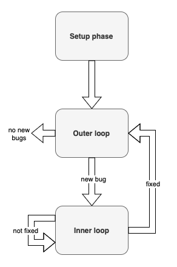

# AFL Loop

### Idea
- Use [AFL](https://lcamtuf.coredump.cx/afl/) (American Fuzzing Lop) to test C/C++ applications
- Once a crash is detected we levarage an LLM to fix it

### Usage
- Preliminaries:
    - See requirements on the [afl-training repository](https://github.com/mykter/afl-training/tree/main) 
        - my suggestion is to run it inside the provided docker container
    - Python v3.8.10
    - Dependencies: argparse, anthropic, dotenv
    - Implement an harness for your target application to allow proper interaction with AFL
    - afl_loop.py needs three files:
        - one containing the instructions to build the target program
        - one containing the instructions to run AFL with that target
        - one containing the instructions to run the target program on its own
            - if the program reads from file then swap the filename argument with "INPUT"
            - if the program needs the file content as an argument then swap that with "INPUT_STDIN"
    - create a `.env` with OpenAI key specified
        - e.g. `ANTHROPIC_API_KEY=sk-proj-.......`
        - LLM currently in use: Claude3
    - a configuration file can optionally be specified with the following parameters
        - maximum queue timeout
            - that is the longest amount of time we continue fuzzing after we have found the last bug
        - maximum number of tries we do to fix a broken function
        - the timeout between llm request to avoid hitting the rate limiter
    

- How to launch afl_loop.py
    - `python3 afl_loop.py [optional arguments]`
        - `-p` followed by the path of the target application - where the executable is contained. (dflt: ".")
        - `-b` followed by the path to a file containing the instructions (dflt: "build.txt")
        - `-r` followed by the path to a file containing the instructions to run the target without the fuzzer ("run.txt")
        - `-f` followed by the path to a file with the instructions to run the fuzzer with the target ("fuzz.txt")
    - notes:
        - `-b`, `-r` and `-f` paths must be relative to the path specified with `-p`
            - e.g. if `... -p folder1/folder2 -b build.txt ...` then the build instruction file will be searched in folder1/folder2/build.txt

### Implementation
1) **Setup phase**
    - parse command line arguments
    - create tmp folder
    - load `.env` file containing the LLM key
    - create LLM client
2) **External loop**
    - build the program
    - launch the fuzzer
    - start monitoring
    3) **Internal loop**: once a bug is found
        - grab a file from the queue
        - run the target with the bug-inducing input
        - parse the report
        - find possible buggy functions
        - fix buggy functions
        - re-build the program
        - re-run the program

### Contacts
Filippo Del Nero - fgdelnero@gmail.com
